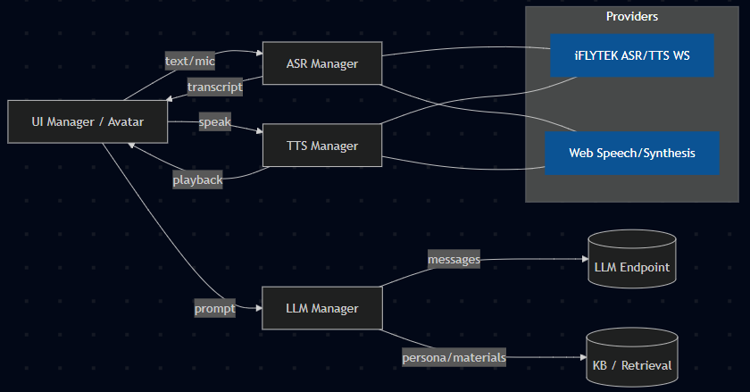

<p align="center">
    
</p>

<h1 align="center">JiuXi Mindscape — AI Conversation Service</h1>

<p align="center">
    🗣️ Voice-enabled avatar chat for on-site cultural tours **(Chinese, English, Malay)**
</p>

<p align="center">
    <a href="#-features">Features</a> ·
    <a href="#-quick-start">Quick Start</a> ·
    <a href="#-configuration-settings">Configuration</a> ·
    <a href="#-system-architecture">Architecture</a> ·
    <a href="#-troubleshooting">Troubleshooting</a>
</p>

<p align="center">
    
    
    
    
    
    
</p>

---

## ✨ Features

This Single Page Application (SPA) is designed to be a **robust and lightweight** AI narrator/concierge interface, prioritizing a seamless text and voice chat experience for cultural tourism.

- **Integrated Voice UX**: Supports both **Text Input** (Enter to send) and a **Push-to-Talk** flow using microphone input (ASR).
- **Provider Flexibility**: Offers high-fidelity **iFLYTEK** (CN/Global) WebSocket services with seamless **browser fallbacks** (Web Speech API for ASR, SpeechSynthesis for TTS).
- **Offline/Demo Mode**: **Mock Mode** for instant, zero-credential, offline demonstrations (recommended for first run).
- **LLM Agnostic**: Connects to any compatible **Configurable LLM REST endpoint** (e.g., DeepSeek, custom gateway, OpenAI API compatible).
- **Context Management**: Advanced prompt construction using **Persona Profiles**, **Knowledge Materials**, and a simplified **RAG (Retrieval-Augmented Generation)** logic.
- **Animated Avatar**: Dynamic avatar states (GIF/MP4/CSS) for visual feedback: _idle, listening, thinking, talking, issue_.
- **Debugging & Persistence**: In-app **Settings & Logs modals** for configuration persistence (`localStorage`) and debugging. Supports export/import (hiding sensitive keys).
- **Optional Local ASR**: Includes support for an optional **Whisper local transcription server** (via `main.py` and `Transformers`) for enhanced offline/private voice input.

---

## 🧭 Context: JiuXi Mindscape

This component provides the core **AI narrator/concierge interface** for the JiuXi Mindscape rural cultural tourism project.

- **Deployment**: Can run standalone or be embedded (via iframe or WebView).
- **Design Goal**: Lightweight, highly resilient, and capable of **offline-capable demos** to reduce friction in site deployment.

---

## 🚀 Quick Start

This project requires **no build step** and can be served directly by any static web server.

> **Note**: For **microphone access** (ASR), you must use **HTTP** or **localhost**.

1. **Serve Locally** (using PHP's built-in server or a development environment like XAMPP/MAMP):

   ```bash
   # Option A: PHP Built-in Server (PHP 5.4+)
   # Run this command from the root of the project (where index.html is)
   php -S localhost:8000

   # Option B: Dedicated Dev Environment (XAMPP)
   # 1. Place the project files (src) into the htdocs directory.
   # 2. Start the Apache server.
   ```

2. **Open in Browser**:

   ```
   http://localhost:8000/
   ```

3. **Run Demo**:
   - Click the **⚙ Settings** icon.
   - Enable **Mock Mode** (recommended for first run) for an instant, fully offline demonstration.
   - Fill in your iFLYTEK / LLM credentials to go live.
   - Ensure you grant **microphone permission** when prompted.

---

## ⚙ Configuration & Settings

Settings are managed via the in-app modal, persisted to `localStorage` (`app_settings_v1`), and directly control which **provider** is active.

### Key LLM Configuration

| Setting          | Type       | Description                                                         |
| :--------------- | :--------- | :------------------------------------------------------------------ |
| **LLM Endpoint** | `URL`      | The REST API URL for your Large Language Model.                     |
| **LLM API Key**  | `String`   | API key/token required for authentication.                          |
| **Persona File** | `Dropdown` | Selects the `data/persona.*.json` file to use for context.          |
| **RAG Mode**     | `Boolean`  | Toggles the use of the `data/*.json` knowledge base for simple RAG. |

### Voice Providers (ASR/TTS)

The application attempts to use high-fidelity WebSocket providers first, with browser fallbacks for resilience.

| Service                  | Primary Provider    | Fallback Provider   | Files                                        |
| :----------------------- | :------------------ | :------------------ | :------------------------------------------- |
| **ASR** (Speech-to-Text) | iFLYTEK (CN/Global) | Web Speech API      | `provider/xfyun_*.js`, `provider/web_asr.js` |
| **TTS** (Text-to-Speech) | iFLYTEK (CN/Global) | SpeechSynthesis API | `provider/xfyun_*.js`, `provider/web_tts.js` |

> **Security Warning**: iFLYTEK keys and other sensitive credentials are used client-side to generate signed WebSocket URLs (HMAC). **Do not deploy without careful consideration.** For production, a **server-side gateway** that proxies the signing process is strongly recommended.

---

## 🧩 System Architecture

The system uses a highly modular frontend architecture to manage the asynchronous and stateful nature of the conversation flow.



---

## 📁 Project Structure

```
src/
  index.html           # Main UI + Settings/Logs modal
  style.css            # Layout + avatar animations
  script.js            # Bootstrap: UI/ASR/TTS/LLM/Persona/Logger
  testcase.html        # Dev/test harness
  assets/              # GIF/MP4/images for avatar states
  data/                # persona.*.json, kb_index.json, data*.json (RAG)
  provider/            # xfyun_cn.js, xfyun_global.js, web_asr.js, web_tts.js
  services/            # asrManager.js, ttsManager.js, llmManager.js, settingManager.js, ...
  utils/base64.js
  main.py              # (optional) local Whisper server
requirement.txt        # (optional) Python deps for main.py

```

## 🐛 Troubleshooting

| Issue                    | Potential Solution                                                                                                           |
| :----------------------- | :--------------------------------------------------------------------------------------------------------------------------- |
| **Mic not working**      | Ensure you are on**HTTP** or **localhost**. Check browser site permissions.                                                  |
| **No TTS voice**         | Ensure**useWebTTS** is enabled in settings or verify iFLYTEK credentials. TTS voices vary by OS/browser.                     |
| **iFLYTEK Auth Errors**  | **Verify** your region, `appId`, `apiKey`, and `apiSecret`. Check your **device time**—it must be accurate for HMAC signing. |
| **WeChat/WebView Audio** | Some WebViews require a**user gesture** (a button click) to unlock audio playback. See `soundGate.js`.                       |

---

## 👨‍💻 Team

| Role        | Name                | Faculty                                                   |
| :---------- | :------------------ | :-------------------------------------------------------- |
| Developer   | Min Yu              | Bachelor of Information Technology                        |
| Leader      | Dr Choo Yen Lee     | AI & Robotics Lecturer                                    |
| Leader      | Sylvia Tan Huey Wen | Arts & Design Lecturer                                    |
| Designer    | Xin Tong            | Bachelor in Graphic Design                                |
| Designer    | Zhi Ying            | Bachelor in Graphic Design                                |
| Contributor | Jun Hao             | Bachelor of information system in Artificial Intelligence |

---

## 📄 License

This project is licensed under the **MIT License**.

> MIT © JiuXi Mindscape Team. Media assets (MP4s) remain under their respective licenses.
